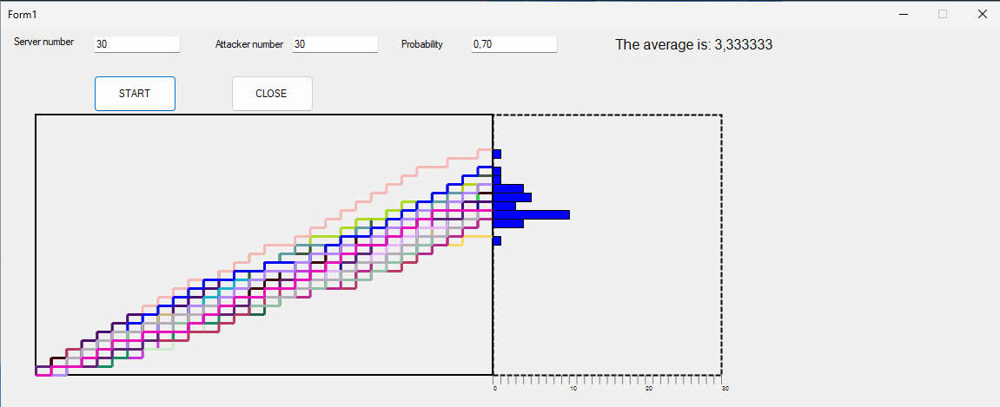

# Link to Theory
To see the answer of the question of the homework 1 [click on this link](hw1Theory.md)


# The Final Result 


# Overview
Doing the program I have divided the code in different function, here i am going to present only the essential part of the program (Not how I created the rectangle the design), the rest can be seen at the github repository [Github Repo] (https://github.com/Viiiiin/Statistics/tree/main/homework_1/homework_1)

# Explanation of C# Code: Paint_Attack Method

## Overview

This part of the C# code contains two methods, `Paint_Attack` and `Attack`, that are likely part of a graphical application that visualizes an attack simulation. The `Paint_Attack` method is responsible for drawing the results of the attack simulation on a graphical interface, while the `Attack` method determines whether a single attack attempt is successful based on a probability threshold.

```csharp
   if (this.attacker == 0 || this.server == 0)
   {
       return;
   }
   ```
## Method: `Paint_Attack`
```csharp
private void Paint_Attack(object sender, PaintEventArgs e)
{
    if (this.attacker ==0 || this.server == 0)
        {
            return;
        }
    Graphics g = e.Graphics;
    g.SmoothingMode = System.Drawing.Drawing2D.SmoothingMode.AntiAlias;

    int count;
    Color color;
    PointF current_point, next_point;
    Pen pen;
    for (int i = 0; i < this.attacker; i++)
    {
        count = 0;
        color = Color.FromArgb(random.Next(0, 256), random.Next(0, 256), random.Next(0, 256));
        current_point = new PointF(START_X, this.height+START_Y);
        next_point = new PointF(START_X, this.height+START_Y);
        pen = new Pen(color, 3);

        for (int j = 0; j < this.server; j++)
        {
            if (Attack())
            {
                next_point = new PointF(current_point.X, current_point.Y - y_space);
                g.DrawLine(pen, current_point, next_point);
                current_point = next_point;
                count++;
            }

            next_point = new PointF(current_point.X + x_space, current_point.Y);
            g.DrawLine(pen, current_point, next_point);
            current_point = next_point;
        }

        this.result[count] += 1;
    }
}
  ```
### Logic Flow

1. **Early Exit**:
   ```csharp
   if (this.attacker == 0 || this.server == 0)
   {
       return;
   }
   ```
   The method first checks if the number of attackers or servers is zero. If either is zero, the method returns early without performing any drawing.

2. **Graphics Setup**:
   ```csharp
   Graphics g = e.Graphics;
   g.SmoothingMode = System.Drawing.Drawing2D.SmoothingMode.AntiAlias;
   ```
   The graphics object is obtained from the `PaintEventArgs`. Anti-aliasing is enabled to ensure smooth lines are drawn.

3. **Loop through Attackers**:
   ```csharp
   for (int i = 0; i < this.attacker; i++)
   ```
   The outer loop iterates over the number of attackers.

4. **Random Color Generation**:
   ```csharp
   color = Color.FromArgb(random.Next(0, 256), random.Next(0, 256), random.Next(0, 256));
   ```
   A random color is generated for each attacker using RGB values, which are randomly selected between 0 and 255.

5. **Drawing Logic**:
   - The `current_point` is initialized at a starting position:
     ```csharp
     current_point = new PointF(START_X, this.height + START_Y);
     ```
   - The inner loop iterates through the number of servers:
     ```csharp
     for (int j = 0; j < this.server; j++)
     ```
     - For each server, the `Attack` method is called:
       ```csharp
       if (Attack())
       ```
       If the attack is successful, a line is drawn upwards:
       ```csharp
       next_point = new PointF(current_point.X, current_point.Y - y_space);
       g.DrawLine(pen, current_point, next_point);
       current_point = next_point;
       count++;
       ```
     - Regardless of the attack result, a horizontal line is drawn to represent the server processing:
       ```csharp
       next_point = new PointF(current_point.X + x_space, current_point.Y);
       g.DrawLine(pen, current_point, next_point);
       current_point = next_point;
       ```
   - The `result` array is updated based on the number of successful attacks:
     ```csharp
     this.result[count] += 1;
     ```

## Method: `Attack`

### Logic

The `Attack` method determines whether an attack is successful based on a random number:

```csharp
    private Boolean Attack()
    {
        float randomNumber = (float)random.NextDouble();
        return this.probability >= randomNumber;
    }
```

1. A random float value between 0.0 and 1.0 is generated.
2. The method checks if this random number is less than or equal to `this.probability`.
3. If so, the attack is considered successful, and the method returns `true`; otherwise, it returns `false`


## Method: `average`

### Parameters

- **int i**: The current index in the `result` array being processed.
- **float cumulativeAverage**: The cumulative average calculated up to the current index.
- **int numberOfAttempts**: The count of successful attempts encountered so far.

### Logic Flow

1. **Base Case**:
   ```csharp
   if (i >= result.Length)
   {
       return numberOfAttempts > 0 ? cumulativeAverage : 0;
   }
   ```
   The method checks if the current index `i` has reached or exceeded the length of the `result` array. If so, it returns the cumulative average if there were any attempts; otherwise, it returns `0`.

2. **Processing the Current Element**:
   ```csharp
   if (result[i] > 0)
   {
       numberOfAttempts++;
       cumulativeAverage += (result[i] - cumulativeAverage) / numberOfAttempts;
   }
   ```
   If the current element in the `result` array at index `i` is greater than `0`, the following actions are performed:
   - The `numberOfAttempts` is incremented by `1` to account for the successful attempt.
   - The cumulative average is updated 
   This formula adjusts the average based on the new value and the updated count of attempts.

3. **Recursive Call**:
   ```csharp
   return average(i + 1, cumulativeAverage, numberOfAttempts);
   ```
   The method then makes a recursive call to itself, incrementing the index `i` by `1` to process the next element in the `result` array.

## Method: `Paint_Result`
   ```csharp
        private void Paint_Result(object sender, PaintEventArgs e)
        {
            if (this.attacker == 0 || this.server == 0)
            {
                return;
            }
            float space = ((float)this.width / 2) / this.attacker;
            Graphics g = e.Graphics;
            Pen pen = new Pen(Color.Black, 1);
            PointF current_point, next_point;
            current_point = new PointF(START_X+ this.width, this.height + START_Y);
            Font font = new Font("Arial", 12);

            for (int i = 0; i < this.result.Length; i++)
            {

                if (this.result[i] > 0)
                {
                    next_point = new PointF(current_point.X + (this.result[i] * space), current_point.Y );
                    RectangleF rect = new RectangleF(current_point.X, current_point.Y, (this.result[i] * space),this.y_space);
                    g.FillRectangle(Brushes.Blue, rect); 

                    g.DrawRectangle(pen, Rectangle.Round(rect)); 
                }
                current_point.Y -= this.y_space;
            }
            float avg = average(0,0,0);
            g.DrawString($" The average is: {avg}", font, Brushes.Black, 700, 10);

        }

      ```
### Logic Flow

1. **Early Exit**:
   ```csharp
   if (this.attacker == 0 || this.server == 0)
   {
       return;
   }
   ```
   The method first checks if the number of attackers or servers is zero. If either is zero, the method returns early without performing any drawing.

2. **Space Calculation**:
   ```csharp
   float space = ((float)this.width / 2) / this.attacker;
   ```
   The variable `space` is calculated to determine the width of the rectangles to be drawn based on the total available width divided by the number of attackers.

3. **Graphics Setup**:
   ```csharp
   Graphics g = e.Graphics;
   Pen pen = new Pen(Color.Black, 1);
   PointF current_point, next_point;
   current_point = new PointF(START_X + this.width, this.height + START_Y);
   Font font = new Font("Arial", 12);
   ```
   The graphics object is obtained from the `PaintEventArgs`, and a pen is created for drawing outlines of rectangles. The starting point for drawing is initialized, and a font is defined for displaying the average text.

4. **Loop through Result Array**:
   ```csharp
   for (int i = 0; i < this.result.Length; i++)
   ```
   The loop iterates over the `result` array, which contains the counts of successful attack attempts.

5. **Drawing Rectangles**:
   ```csharp
   if (this.result[i] > 0)
   {
       next_point = new PointF(current_point.X + (this.result[i] * space), current_point.Y );
       RectangleF rect = new RectangleF(current_point.X, current_point.Y, (this.result[i] * space), this.y_space);
       g.FillRectangle(Brushes.Blue, rect); 
       g.DrawRectangle(pen, Rectangle.Round(rect)); 
   }
   current_point.Y -= this.y_space;
   ```
   For each successful attack count in the `result` array, the method:
   - Calculates the `next_point` based on the current count multiplied by `space`.
   - Creates a rectangle based on the current position and size determined by the count and a predefined height (`y_space`).
   - Fills the rectangle with a blue color and draws its outline using the black pen.
   - Updates the `current_point`'s Y-coordinate to move down for the next rectangle.

6. **Calculating and Displaying Average**:
   ```csharp
   float avg = average(0, 0, 0);
   g.DrawString($" The average is: {avg}", font, Brushes.Black, 700, 10);
   ```
   After drawing all rectangles, the method calls the previously defined `average` method to calculate the average of successful attempts. It then draws a string displaying the average at a specified position on the graphics surface.


