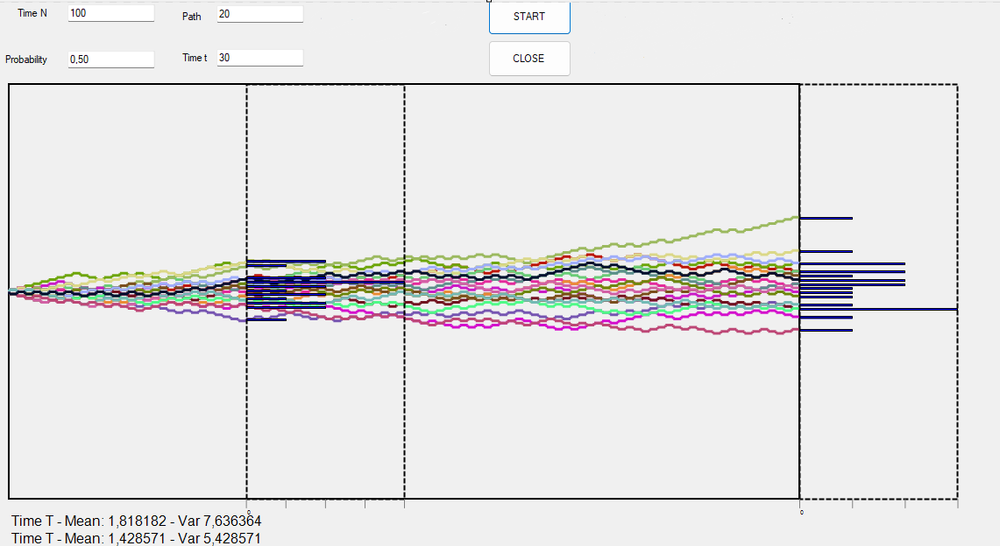
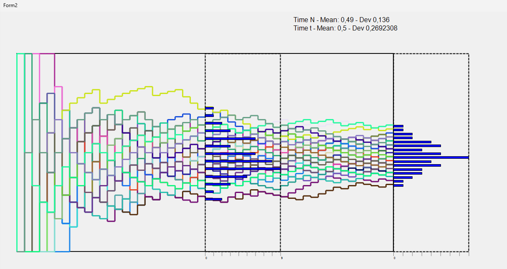

# Link to Theory
To see the answer to the question of homework 2 [click on this link](https://viiiiin.github.io/hwTheory2.html)

## Overview


The application allows you to specify:
- The number of servers and attackers.
- The probability of successful attacks.
- Time `t` to observe intermediate results.

It then creates two Forms: one for the absolute frequency and another for the relative frequency using the same parameters.

## Main Components

### 1. Absolute Frequency `Paint_Attack`

The `Paint_Attack` method simulates the trajectory of an attacker. If the attack is successful, the count increases by 1, otherwise, it decreases by 1. 
For each attacker, the result at time T is saved in the `result_t` vector and the result at time N in the `result` vector.

```csharp
private void Paint_Attack(object sender, PaintEventArgs e)
{
    .
    .
    .
    
    // Loop through all attackers
    for (int i = 0; i < this.attacker; i++)
    {
        count = 0;
        color = Color.FromArgb(random.Next(0, 256), random.Next(0, 256), random.Next(0, 256));
        current_point = new PointF(START_X, (this.height / 2 + START_Y));
        next_point = new PointF(START_X, (this.height / 2 + START_Y));
        pen = new Pen(color, 3);

        // Loop through the attack attempts against the server
        for (int j = 0; j < this.server; j++)
        {
            if (Attack()) 
            {
                // The attack is successful, moves upward
                next_point = new PointF(current_point.X, current_point.Y - y_space);
                count++;
            }
            else 
            {
                // The attack fails, moves downward
                next_point = new PointF(current_point.X, current_point.Y + y_space);
                count--;
            }

            g.DrawLine(pen, current_point, next_point);
            current_point = next_point;

            // Moves right for the next attempt
            next_point = new PointF(current_point.X + x_space, current_point.Y);
            g.DrawLine(pen, current_point, next_point);
            current_point = next_point;

            // Updates the results for time `t`
            if (j == t)
            {
                this.result_t[count + this.server] += 1;
            }
        }

        // Stores the final results for the current attacker
        this.result[count + this.server] += 1;
    }
}
```
#### Relative Frequency `Paint_Attack`
Each attacker has its own trajectory and a relative score, which is updated at each step based on the success or failure of each attack attempt.

Ascending lines: indicate a series of successes (relative_score increases).
Stable or descending lines: indicate that the attacker is failing more often (relative_score remains low).
Distribution of Relative Scores: The results at time t and the final results are stored in two dictionaries (result_t and result_n), which are used for constructing distributions and calculating the mean.
```csharp
for (int j = 0; j <this.server; j++)
{
    if (Attack())
    {
        jumps++;
    }
    relative_score = jumps / (float)(j + 1);
    
    next_point = new PointF(current_point.X, this.height + START_Y - (relative_score * this.height)); //Mi posiziono al punto Y calcolato
    g.DrawLine(pen, current_point, next_point);
    current_point = next_point;
    next_point = new PointF(current_point.X + x_space, current_point.Y);
    g.DrawLine(pen, current_point, next_point);
    current_point = next_point;
```

### Mean and Deviance
```csharp
        public void CalculateMeanAndDeviation(int[] result, out float mean, out float var)
        {
            float delta, dev;
            int n = 0;
            mean = 0;
            dev = 0;
            int score,offset = 0;
            if (this.server +1  < result.Length)
            {
                offset = this.server;
            }

            for (int index = 0; index < result.Length; index++)
            {
                int count = result[index]; // Numero di persone con quello score
                if (count > 0) // Solo per score presenti
                {
                    score = index - offset; // Calcola lo score reale, considerando l'offset

                    for (int i = 0; i < count; i++) // Per ogni persona con quello score
                    {
                        n++;
                        delta = score - mean;
                        mean += delta / n; // Aggiorna la media
                        dev += delta * (score - mean); // Aggiorna la somma dei quadrati delle deviazioni
                    }
                }
            }
            var = dev / n;
            
        }

 ```
 
# Personal Notes on the Behavior of Mean and Variance with Respect to Time

## 1. Observations in the Four Different Cases

### A. Absolute Frequency (AF)
- **Mean**:
  - The mean of absolute frequencies tends to increase with the number of trials. Initially, it can show a lot of variability due to the random nature of successes and failures.
  - The mean can be misleading in small samples, as it does not account for the total number of trials.

- **Variance**:
  - The variance of AF may be high, especially in small sample sizes, as the number of successes can fluctuate significantly.
  - As the number of trials increases, the variance generally decreases, but it can still reflect significant fluctuations due to individual trial outcomes.

### B. Relative Frequency (RF)
- **Mean**:
  - The mean of relative frequencies stabilizes as the number of trials increases. It converges toward the true probability of success for the process being evaluated.
  - RF provides a more accurate representation of performance as it reflects the average success rate over many trials.

- **Variance**:
  - The variance of RF decreases over time, as the RF tends to smooth out random fluctuations and converge towards a stable value.
  - It can still exhibit variability in early trials, but this decreases as the number of observations grows.

### C. Bernoulli Process
- **Mean**:
  - In a Bernoulli process, the mean of the successes converges towards the expected probability of success (p) as the number of trials increases.
  - The mean is calculated directly from the proportion of successes over the total number of trials, making it reliable in large samples.

- **Variance**:
  - The variance in a Bernoulli process can be calculated using the formula \( p(1-p) \). As the number of trials increases, the observed variance tends to approximate this theoretical value.
  - The variance stabilizes as more data is collected, reinforcing the reliability of the mean.

### D. Random Walk
- **Mean**:
  - The mean of a random walk remains centered around zero in symmetric random walks, but it can drift if there is a bias towards positive or negative steps.
  - Over time, the mean tends to show the overall trend, but it can be affected by the random nature of individual steps.

- **Variance**:
  - The variance of a random walk increases with time, as the potential spread of the walk's position increases. This is often modeled as growing linearly with the number of steps.
  - The variance indicates how far from the starting point the walk might be, illustrating increased uncertainty over time.

## 2. Differences Between Absolute Number of Successes and Relative Frequencies

- **Mean**:
  - **AF Mean**: Reflects the raw count of successes. It can vary significantly based on the number of trials and does not provide a normalized view.
  - **RF Mean**: Provides a more meaningful average of success rates, normalizing against total attempts, leading to convergence towards the true probability of success.

- **Variance**:
  - **AF Variance**: Can be high and fluctuate significantly, particularly in small sample sizes, leading to unreliable interpretations of performance.
  - **RF Variance**: Generally lower and stabilizes as the number of trials increases, offering a clearer picture of the underlying process.

## Conclusion

In summary, the behavior of mean and variance concerning time differs significantly across absolute frequency, relative frequency, Bernoulli processes, and random walks. Absolute frequency can be volatile and less informative, while relative frequency provides stability and better reflects the underlying success probabilities. Understanding these differences is crucial for accurately interpreting data in stochastic processes and making informed decisions based on the observed outcomes.

 
 
