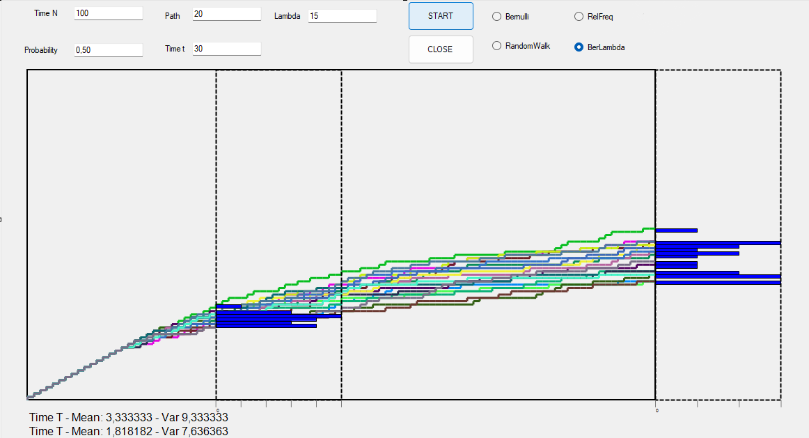

# Link to Theory
To see the answer to the question of homework 3 [click on this link](hw3Theory.md)




# Explanation of the `BerLambda` Class in C#

## Overview
The `BerLambda` class models an attack simulation using a Bernoulli process with a parameter `lambda`. The class uses graphical rendering to depict the attacks over time.

### Key Properties
- **`graph`**: Represents the graphical area where the simulation is visualized.
- **`server`**: The total number of steps (servers) in the simulation.
- **`attacker`**: The number of attackers performing the simulation.
- **`t`**: A specific time step at which a result is recorded.
- **`lambda`**: Controls the likelihood of a successful attack at each step.
- **`result` and `result_t`**: Arrays used to store the counts of successes for each attacker at specific points and at time `t`.

## Function: `Attack`
### Description
This function determines whether an attack is successful at a given step \( N \).
- **Input**: An integer `N`, which represents the current step.
- **Logic**: Generates a random float between 0 and 1 and compares it with a dynamically adjusted threshold based on `lambda`:
  - \( \text{Threshold} = \frac{\lambda}{N + 1} \)
- **Output**: A boolean value indicating the success or failure of the attack.

### Code Snippet
```csharp
private Boolean Attack(int N)
{
    float randomNumber = (float)random.NextDouble();
    return this.lambda / (float)(N + 1) >= randomNumber;
}
```
- **Key Insight**: As `N` increases, the threshold decreases, making attacks less likely to succeed at higher `N`. This simulates a decreasing probability of success as time progresses.

## Function: `Paint_Attack`
### Description
This method visualizes the attack simulation by drawing lines on the graphical object.
- **Logic**:
  - If either `attacker` or `server` is zero, the method exits.
  - Iterates over each attacker and simulates attacks across each server step.
  - Tracks the count of successful attacks and updates the `result` arrays.

### Key Part of the `for` Loop
```csharp
for (int i = 0; i < this.attacker; i++)
{
    count = 0;
    // Initialization of graphical properties (omitted for brevity)
    
    for (int j = 0; j < this.server; j++)
    {
        if (Attack(j))
        {
            // Update the graphical path for a successful attack (move up)
            count++;
        }
        // Update the graphical path for the next step (move right)
        
        if (j == t)
        {
            this.result_t[count] += 1;
        }
    }

    this.result[count] += 1;
}
```

### Highlights
- **Outer Loop**: 
  - Iterates over each `attacker` to simulate their actions.
  - Initializes the path and graphical properties for each attacker.

- **Inner Loop**:
  - Simulates attacks at each server step using the `Attack` function.
  - Updates the graphical path based on the outcome of the `Attack` function.
  - Tracks the count of successful attacks.

