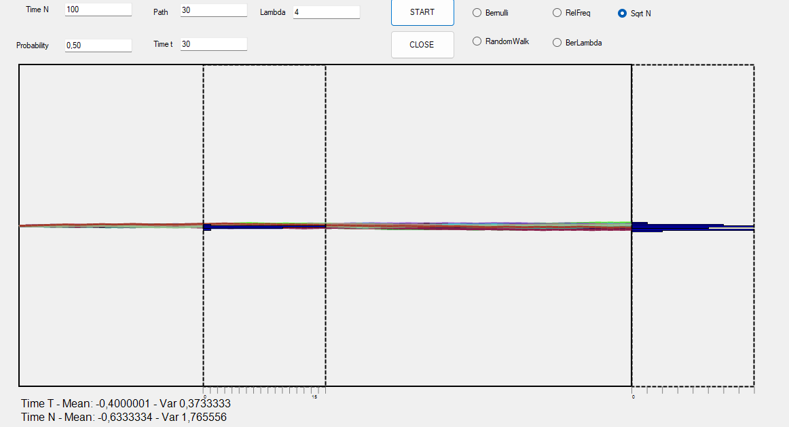

# Link to Theory
To see the answer to the question of homework 4 [click on this link](https://viiiiin.github.io/hwTheory4.html)




# Modified `Paint_Attack` Function in `SqrN`

The `Paint_Attack` function in the `SqrN` class builds upon a standard random walk approach, with specific modifications to introduce dynamic scaling based on the number of steps (`server`). This refined approach adjusts the step size for each attacker, creating a smoother path that reflects the scaling limit of a random walk as the number of steps increases.

## Modifications from Standard Random Walk

1. **Dynamic Vertical Step Scaling**:  
   The main change is the introduction of the `space` variable, calculated as:
   ```csharp
   float space = (float)Math.Sqrt(1.0 / this.server);

   ```
This scaling factor modifies the vertical movement for each step, making the size of each "jump" in the random walk dependent on the number of steps (server). The modified vertical movement is:

```csharp
if (Attack())
{
    next_point = new PointF(current_point.X, current_point.Y - (y_space * space));
    count++;
}
else
{
    next_point = new PointF(current_point.X, current_point.Y + (y_space * space));
    count--;
}
```

This adjustment aligns with continuous stochastic processes, where step sizes decrease as the number of steps (server) grows, simulating a finer approximation of continuous time.

2. **Result Array Indexing with Scaling Factor:**
The indexing for result and result_t arrays incorporates the space factor, aligning each attacker’s final position with a scaled index:


```csharp
this.result_t[(int)((count * space) + this.server)] += 1;
this.result[(int)((count * space) + this.server)] += 1;
```