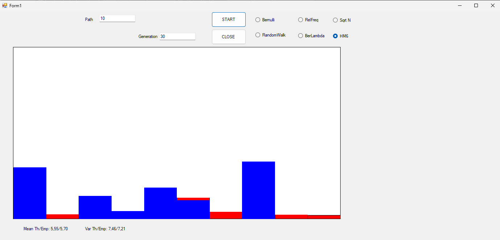
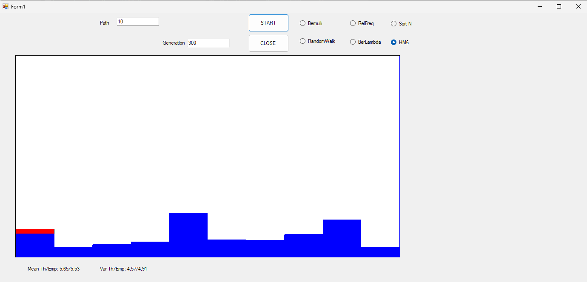
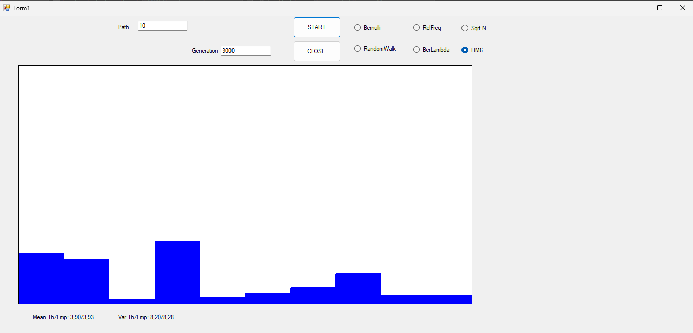

# Link to Theory
To see the answer to the question of homework 6 [click on this link](hw6Theory.md)

# Convergence of Empirical Distribution to Theoretical Distribution

## Overview
Analyzing the relationship between theoretical and empirical distributions provides insight into the accuracy of a model when compared to observed data. The included graph highlights the interplay between:
- **Theoretical distribution**: depicted in red, representing the expected values defined by a mathematical model.
- **Empirical distribution**: depicted in blue, based on simulated or observed data.

This study demonstrates how the empirical distribution increasingly aligns with the theoretical one as the number of generations grows.

## Distribution Convergence
### Theoretical Distribution
The theoretical distribution is derived from an established probabilistic model. It represents the idealized behavior under controlled assumptions.

### Empirical Distribution
The empirical distribution reflects the results of simulations or real-world observations. As the number of generations increases, the **Law of Large Numbers** ensures that the empirical distribution approaches the theoretical one.

In the graph:
- **Red**: illustrates the expected theoretical values.
- **Blue**: shows the values derived from the simulation.

With more generations, the overlap between the red and blue bars becomes more pronounced, signifying convergence.

## Convergence of Mean and Variance
The convergence also applies to key statistical measures:
- **Mean**: as a measure of central tendency, the empirical mean approximates the theoretical mean with increasing generations.
- **Variance**: as a measure of data dispersion, the empirical variance also approaches the theoretical value over time.

The graph with 30 generation displays:
- **Mean (Theoretical/Empirical)**: 5.55/5.70.
- **Variance (Theoretical/Empirical)**: 7.46/7.21.

The graph with 300 generation displays:
- **Mean (Theoretical/Empirical)**: 5.65/5.53.
- **Variance (Theoretical/Empirical)**: 4.57/4.91.

The graph with 3000 generation displays:
- **Mean (Theoretical/Empirical)**: 3.90/3.93.
- **Variance (Theoretical/Empirical)**: 8.20/8.28.

The discrepancy diminishes as the number of generations increases, reinforcing the alignment.

