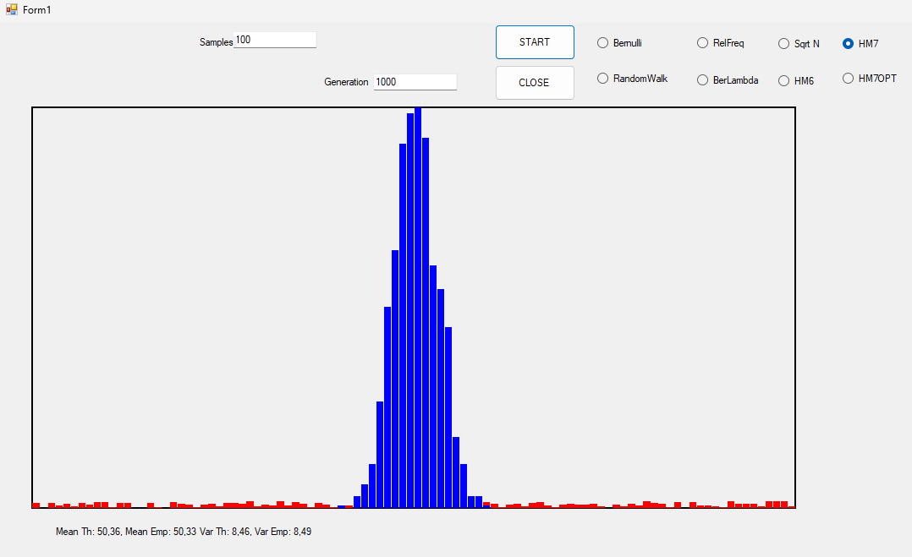
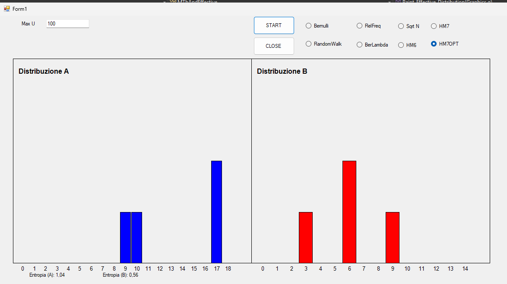

# Central Limit Theorem, (Code Logic)

[GitHub](https://github.com/Viiiiin/Statistics/blob/main/homework_2/homework_1/MThAndEmp.cs)
## 1. Setup 

Create a discrete parent distribution with probabilities for each value. 

**Example:**

- **Values:** {1, 2, 3, 4, 5}  
- **Probabilities:** {0.1, 0.2, 0.4, 0.2, 0.1}  

Compute the **theoretical mean** ($\mu$) and **variance** ($\sigma^2$) of the parent distribution using the following formulas:

$$
\mu = \sum_{i=1}^{k} x_i p(x_i), \quad \sigma^2 = \sum_{i=1}^{k} p(x_i)(x_i - \mu)^2
$$

## 2. Generate Samples

From the parent distribution, generate $m$ samples, each of size $n$:

- $m = 1000$ (number of samples).  
- $n = 20, 40, 60$ (sample sizes).  

For each sample, compute the **sample average**:

$$
\bar{X} = \frac{1}{n} \sum_{i=1}^{n} X_i
$$

## 3. Analyze the Sampling Distribution of the Averages

- Compute the **mean** ($\mu_{\bar{X}}$) and **variance** ($\sigma^2_{\bar{X}}$) of the sample averages:
  - $\mu_{\bar{X}}$: Should approximate $\mu$, the mean of the parent distribution.
  - $\sigma^2_{\bar{X}}$: Should approximate $\frac{\sigma^2}{n}$, where $\sigma^2$ is the variance of the parent distribution.

- The **histogram** will behave such that as $n$ increases, the distribution will approach a normal distribution due to the Central Limit Theorem.

## 4. Relationship with Parent Distribution

- The **mean** of the sampling distribution of averages ($\mu_{\bar{X}}$) matches the **mean** of the parent distribution ($\mu$).
- The **variance** of the sampling distribution decreases with sample size, following the formula:

$$
\sigma^2_{\bar{X}} = \frac{\sigma^2}{n}
$$

## Observation

1. The larger the sample size ($n$), the smaller the variance in the sampling distribution ($\sigma^2_{\bar{X}}$).
2. The sampling distribution becomes increasingly **normal** as $n$ increases, regardless of the parent distribution's shape.

---

# Homework: Optional - Exploring Cryptographic Properties

[GitHub](https://github.com/Viiiiin/Statistics/blob/main/homework_2/homework_1/Crypto.cs)
## Observations and Analysis

### 1. Shape of the Distributions:

- **Case A**: For \( n = 19 \), the values of \( Y \) are more uniformly distributed, as 19 is a prime number and exhibits good cryptographic properties.
- **Case B**: For \( n = 15 \), since 15 is a composite number, the distribution shows some predictable patterns or groupings due to its divisibility properties (e.g., factors of 3 and 5). This results in lower entropy and a less uniform distribution.

### 2. Entropy or Diversity Index:
To assess the randomness of the distributions, compute the **entropy** of each distribution. Entropy measures the uncertainty or unpredictability of the outcome.

For a discrete random variable \( X \) with probabilities \( p(x_i) \) for each outcome \( x_i \), entropy is calculated as:

$$
H(X) = - \sum_{i} p(x_i) \log_2 p(x_i)
$$

This formula can be used to calculate the entropy of the distributions of \( Y \). A higher entropy indicates a more uniform and unpredictable distribution.

### 3. Cryptographic Implications:
- **Case A**: The set \( \{ 2, 3, 10, 17 \} \) for \( n = 19 \) is likely chosen because 19 is a prime number, and the values of \( g \) are carefully chosen to ensure that \( g^U \mod 19 \) does not exhibit any obvious patterns or cycles, making it more suitable for cryptographic applications. In this case, we would expect a high entropy (more randomness), which is desirable in cryptographic applications.
  
- **Case B**: For \( n = 15 \), the lower entropy and predictable patterns could represent vulnerabilities in cryptographic applications, as the predictability of the distribution may allow for attacks such as brute force or frequency analysis. The presence of factors such as 3 and 5 in the modulus can make the distribution more susceptible to pattern recognition.

## Questions:
- **Why is the set \( \{ 2, 3, 10, 17 \} \) chosen in Case A?**
  - These values of \( g \) are selected because they produce more uniformly distributed values of \( Y \) when taken modulo a prime number like 19. They avoid cycles or patterns that might arise from choosing poor values of \( g \), which would make the cryptographic system vulnerable to attacks.

- **What are possible errors in the exercise?**
  - There could be potential errors if the value of \( \text{max\_U} \) is not properly defined or if the entropy is not correctly computed, which may affect the conclusions drawn from the analysis.
  - Additionally, if we fail to correctly account for the modular arithmetic or the periodicity of the powers of \( g \), the distributions could be skewed or have undesirable characteristics.
