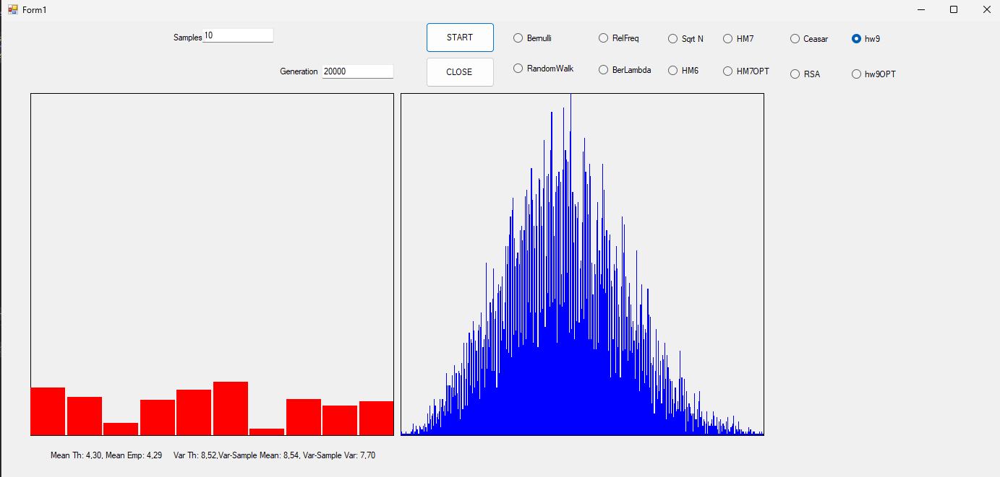

To see the answer to the question of homework 9 [click on this link](hw9Theory.html)

[GitHub](https://github.com/Viiiiin/Statistics/blob/main/homework_2/homework_1/Variance.cs)

# Documentation: `VarThAndEffective` Class

The `VarThAndEffective` class is designed to simulate and analyze theoretical and empirical distributions, focusing on means and variances. It includes methods for generating probabilities, creating samples, and calculating statistical properties.

## Class Overview

### Properties
- **`random`**: A `Random` object used for generating random numbers.
- **`probabilities`**: An array of probabilities representing the theoretical distribution.
- **`generation`**: The number of generations or iterations for simulation.
- **`means`**: An array containing sample means for each generation.
- **`variancesArr`**: An array containing sample variances for each generation.
- **`n`**: The size of the sample (number of data points in a single generation).
- **`labelMean`, `labelVar`**: UI labels to display calculated means and variances.
- **`frequencies`**: A dictionary storing frequencies of variances rounded to six decimals.

## Main Methods

### 1. `Generate_Prob_array()`
Generates and normalizes an array of probabilities:
- **Purpose**: Creates the theoretical probability distribution.
- **Steps**:
  1. Generates random values.
  2. Normalizes the values so their sum equals 1.

### 2. `Create_Distribution(object sender, PaintEventArgs e)`
Executes the main simulation process:
- **Purpose**: 
  - Simulates multiple generations of samples.
  - Calculates empirical means and variances.
  - Compares theoretical and empirical values.
  - Updates `frequencies` with rounded variances for each generation.
- **Key Calculations**:
  - Theoretical mean and variance using `CalculateMeanAndVariance()`.
  - Empirical mean and variance for each generation using `Calculatesamplevariance()` and `UpdateWalford()`.

### 3. `UpdateWalford(ref double mean, ref double variance, double value, int count)`
Updates the running mean and variance incrementally:
- **Purpose**: Efficiently calculates the mean and variance across iterations without storing all data.
- **Parameters**:
  - `mean`: The current mean value.
  - `variance`: The current variance value.
  - `value`: The new data point.
  - `count`: The current count of data points.

### 4. `Calculatesamplevariance(double[] sample, double sampleMean)`
Calculates the sample variance:
- **Purpose**: Determines the variance of a sample based on its mean.
- **Formula**:  
  $$ \[
  \text{Variance} = \frac{\sum{(x_i - \text{Mean})^2}}{n - 1}
  \]$$
- **Returns**: The variance of the provided sample.

### 5. `CalculateMeanAndVariance(double[] array, out double mean, out double variance)`
Calculates the theoretical mean and variance of a distribution:
- **Purpose**: Computes theoretical values based on the probability array.
- **Steps**:
  1. Calculates the mean as a weighted sum of values.
  2. Calculates the variance using the formula for expected variance.

### 6. `GenerateSample(double[] probabilities, int n, int intervals, Random random)`
Generates a sample from the theoretical probability distribution:
- **Purpose**: Simulates a random sample based on the given probability distribution.
- **Process**:
  - For each sample point, selects an interval based on cumulative probabilities.
- **Returns**: An array representing the sample.

---
# Analysis of Sample Variances and Relationship with Parent Distribution

## Distribution of Sample Variances

1. **Determining the Distribution:**
   - The distribution of sample variances, visualized in blue, shows a wide range of values with a peak around the empirical mean of the variances.
   - The shape and spread of this distribution depend on the sample size (`Samples`) and the number of generations (`Generation`).

2. **Mean and Variance of Sample Variances:**
   - **Mean of Variances:** The empirical mean of the variances calculated across generations approximates the theoretical variance (`Var Th`). This is consistent with the Central Limit Theorem, which guarantees the convergence of empirical estimates with sufficiently large samples.
   - **Variance of the Variances:** This value represents the variability among the variances estimated in each generation. A higher variance suggests greater sensitivity to sample-specific fluctuations.

## Relationship with Parent Distribution

1. **Theoretical vs Empirical Mean:**
   - The **theoretical mean** (`Mean Th`) and **empirical mean** (`Mean Emp`) are very close, indicating that the generated samples align well with the parent distribution.
   - Minor deviations can be attributed to random sampling effects, especially when the sample size is relatively small.

2. **Theoretical vs Empirical Variance:**
   - The **theoretical variance** (`Var Th`) defines the expected dispersion within the parent distribution. Empirical variance estimates fluctuate around this value, reflecting the quality of the sample representation.
   - The empirical variance across generations tends to converge to the theoretical variance as the sample size increases.

3. **Overall Relationship:**
   - For sufficiently large samples, the empirical variance of each sample converges to the theoretical variance.
   - For smaller samples, variance estimates exhibit more fluctuations, as reflected in the distribution of sample variances.

## Additional Observations
- The presence of a distribution for the variances (rather than a fixed value) highlights the natural variability in sampling, even when theoretical parameters are known.
- The **total variance of the variances** can serve as an indicator of system stability:
  - Low variance suggests consistent estimates across generations.
  - High variance indicates significant fluctuations and potential instability in the sampling process.

