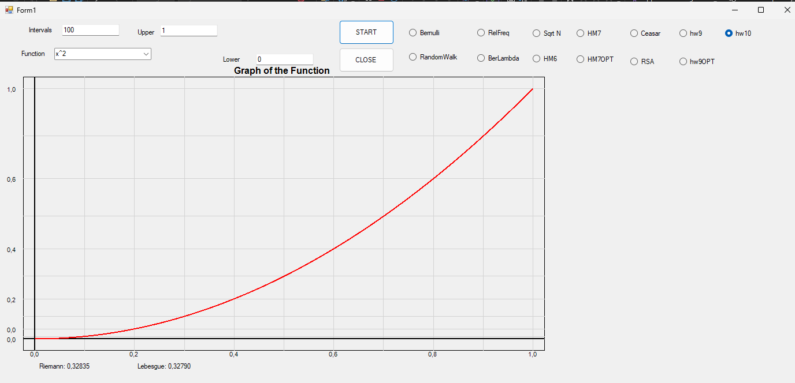

To see the answer to the question of homework 10 [click on this link](../homework/hw10Theory.md)

[GitHub](https://github.com/Viiiiin/Statistics/blob/main/homework_2/homework_1/hw10.cs)
# Numerical Integration with Riemann and Lebesgue Methods

This code implements a **numerical integration** framework in C# that calculates the integral of a function over a specified interval using two different methods:
- **Riemann Integration**
- **Lebesgue Integration (approximated)**

Additionally, the code includes a graphical visualization of the function and labels showing the results of the integrals.

## Components of the Code

### 1. **Constructor and Initialization**
The constructor initializes the parameters required for numerical integration:

### 2. **X-Values Generation**
The method `GenerateXValues` divides the interval `[lowerBound, upperBound]` into `intervals` equally spaced points, which are stored in a list. These points serve as evaluation nodes for the function.

### 3. **Riemann Integral Calculation**
The Riemann integral is computed using the **left Riemann sum**:

$$
\text{Integral}_{\text{Riemann}} = \sum_{i=0}^{n-1} f(x_i) \cdot \Delta x
$$

Here, \(\Delta x\) is the width of each subinterval.

### 4. **Lebesgue Integral Calculation**
The Lebesgue integral is approximated by grouping function values (\(y=f(x)\)) into buckets and associating a measure (sum of widths \(\Delta x\)) to each level. The formula used is:

$$
\text{Integral}_{\text{Lebesgue}} = \sum_{\text{buckets}} (\text{level} \times \text{measure})
$$

This is a simplified approach to illustrate the concept of **measure theory**, focusing on the codomain \(y\) rather than the domain \(x\).

### 5. **Graphical Representation**
The `DrawFunction` method uses the `Graphics` class to plot the function and its corresponding integration results:
- The **function curve** is drawn in red.
- A **grid** and labeled axes provide context for the visualization.
- Calculated values for Riemann and Lebesgue integrals are displayed on the graph using labels.

### 6. **Paint Method**
The `Paint` method hooks into the `PaintEventArgs` of a `Form` or `Panel` to render the graph and compute the integral values.

## Differences Between Riemann and Lebesgue Integrals

### Conceptual Difference
- **Riemann Integration**: Sums up the areas of vertical slices of the function (using the domain \(x\)). This method relies on the function being well-behaved over the interval (e.g., continuous).
- **Lebesgue Integration**: Groups the range (codomain \(y\)) into levels and measures the "size" of the domain corresponding to each level. This is more general and works for functions with discontinuities or on sets of measure zero.

### Numerical Difference
In practice:
- The **Riemann integral** may be more accurate for smooth, continuous functions.
- The **Lebesgue integral approximation** introduces rounding when grouping values into buckets, potentially leading to small numerical discrepancies.

### Output Example
For a function \(f(x) = x^2\) over \([0, 1]\) with 100 intervals:
- **Riemann Integral**: \(0.32835\)
- **Lebesgue Integral**: \(0.32790\) (slight difference due to bucketing and rounding)

# SSL OPT Homework

### Research
[HERE THE FILE FOR THE RESARCH OF THE SSL](testo.txt)
[HERE THE SOURCE CODE](https://github.com/Viiiiin/Statistics/blob/main/ConsoleApp1/ConsoleApp1/Program.cs)