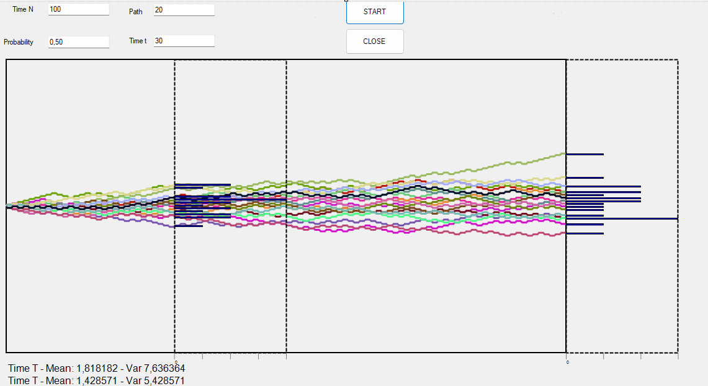
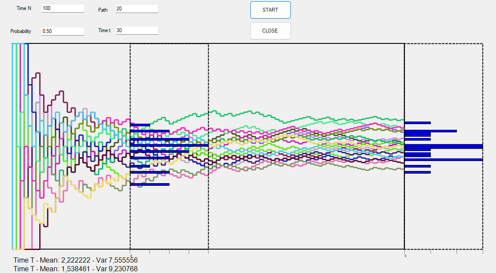

layout: default
title: Homework2
permalink: /homework2
---

# Link to Theory
To see the answer to the question of homework 2 [click on this link](hw2Theory.md)

## Overview


The application allows you to specify:
- The number of servers and attackers.
- The probability of successful attacks.
- Time `t` to observe intermediate results.

It then creates two Forms: one for the absolute frequency and another for the relative frequency using the same parameters.

## Main Components

### 1. Absolute Frequency `Paint_Attack`

The `Paint_Attack` method simulates the trajectory of an attacker. If the attack is successful, the count increases by 1, otherwise, it decreases by 1. 
For each attacker, the result at time T is saved in the `result_t` vector and the result at time N in the `result` vector.

```csharp
private void Paint_Attack(object sender, PaintEventArgs e)
{
    .
    .
    .
    
    // Loop through all attackers
    for (int i = 0; i < this.attacker; i++)
    {
        count = 0;
        color = Color.FromArgb(random.Next(0, 256), random.Next(0, 256), random.Next(0, 256));
        current_point = new PointF(START_X, (this.height / 2 + START_Y));
        next_point = new PointF(START_X, (this.height / 2 + START_Y));
        pen = new Pen(color, 3);

        // Loop through the attack attempts against the server
        for (int j = 0; j < this.server; j++)
        {
            if (Attack()) 
            {
                // The attack is successful, moves upward
                next_point = new PointF(current_point.X, current_point.Y - y_space);
                count++;
            }
            else 
            {
                // The attack fails, moves downward
                next_point = new PointF(current_point.X, current_point.Y + y_space);
                count--;
            }

            g.DrawLine(pen, current_point, next_point);
            current_point = next_point;

            // Moves right for the next attempt
            next_point = new PointF(current_point.X + x_space, current_point.Y);
            g.DrawLine(pen, current_point, next_point);
            current_point = next_point;

            // Updates the results for time `t`
            if (j == t)
            {
                this.result_t[count + this.server] += 1;
            }
        }

        // Stores the final results for the current attacker
        this.result[count + this.server] += 1;
    }
}

#### Relative Frequency `Paint_Attack`
Each attacker has its own trajectory and a relative score, which is updated at each step based on the success or failure of each attack attempt.

Ascending lines: indicate a series of successes (relative_score increases).
Stable or descending lines: indicate that the attacker is failing more often (relative_score remains low).
Distribution of Relative Scores: The results at time t and the final results are stored in two dictionaries (result_t and result_n), which are used for constructing distributions and calculating the mean.
```csharp
for (int j = 0; j <this.server; j++)
{
    if (Attack())
    {
        jumps++;
    }
    relative_score = jumps / (float)(j + 1);
    
    next_point = new PointF(current_point.X, this.height + START_Y - (relative_score * this.height)); //Mi posiziono al punto Y calcolato
    g.DrawLine(pen, current_point, next_point);
    current_point = next_point;
    next_point = new PointF(current_point.X + x_space, current_point.Y);
    g.DrawLine(pen, current_point, next_point);
    current_point = next_point;
```

### Mean and Deviance
```csharp
 public void CalculateMeanAndDeviation(float[] result, out float mean, out float dev)
 {
     float delta;
     int n = 1;
     mean = 0;
     dev = 0;

     for (int i = 0; i < result.Length; i++)
     {
             delta = result[i] - mean;
             mean += delta / n;
             dev += (result[i] - mean) * delta;
             n++;
         
     }
 }
 ```
