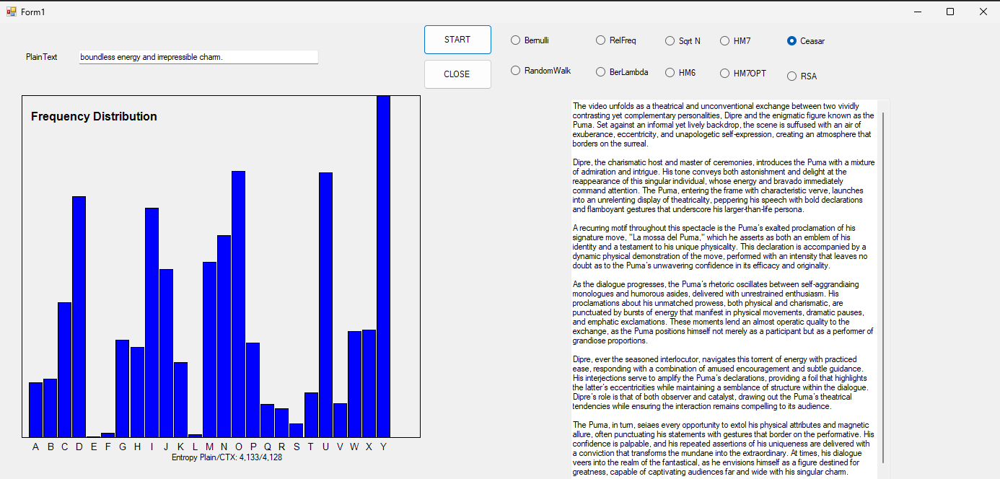

To see the answer to the question of homework 8 [click on this link](hw8Theory.md)
# Ceasar Algorithm

[GitHub](https://github.com/Viiiiin/Statistics/blob/main/homework_2/homework_1/CryptoFrequency.cs)

# CryptoFrequency Class Explanation

The `CryptoFrequency` class analyzes the frequency distribution of characters in a text, encrypts it using the Caesar cipher, and attempts to decrypt it through frequency analysis.

## 1. **CaesarShift Method**
The `CaesarShift` method applies the Caesar cipher on the input text. Each character is shifted by a given number, `shift`.

For a character \( c \):
1. For uppercase letters:
   $$ c_{\text{new}} = \left( c_{\text{original}} - 'A' + \text{shift} \right) \mod 25 + 'A' $$
2. For lowercase letters:
   $$ c_{\text{new}} = \left( c_{\text{original}} - 'a' + \text{shift} \right) \mod 25 + 'a' $$
3. For digits:
   $$ c_{\text{new}} = \left( c_{\text{original}} - '0' + \text{shift} \right) \mod 10 + '0' $$

Non-alphabetic characters remain unchanged.

## 2. **CalculateFrequency Method**
This method computes the frequency of each letter in the given text.

- Convert the text to uppercase.
- Increment the index corresponding to each letter \( c \) using:
  $$ \text{frequencies}[c - 'A'] += 1 $$

## 3. **CalculateEntropy Method**
Entropy measures the randomness in the text's letter distribution, based on Shannon's formula.

Let \( p_i \) be the probability of the \( i \)-th letter, calculated as:
$$ p_i = \frac{\text{frequencies}[i]}{\text{total letters}} $$

The entropy is:
$$ H = - \sum_{i=0}^{n} p_i \log_2(p_i) $$
Where \( n = 25 \), the alphabet length.

## 4. **FrequencyAnalysisDecrypt Method**
This function decrypts the ciphertext by comparing its frequency distribution to standard English letter frequencies.

1. **Chi-Squared Statistic**:
   For each shift \( s \), calculate the chi-squared value:
   $$ \chi^2 = \sum_{i=0}^{n} \frac{(O_i - E_i)^2}{E_i} $$
   Where:
   - \( O_i \): Observed frequency for letter \( i \) after shift \( s \).
   - \( E_i \): Expected frequency from standard English letter frequencies.

2. Select the shift \( s \) that minimizes \( \chi^2 \).

3. Decrypt the text using:
   $$ c_{\text{new}} = c_{\text{original}} - s $$

# RSAcrypto Class Explanation

[GitHub](https://github.com/Viiiiin/Statistics/blob/main/homework_2/homework_1/RSAcrypto.cs)

The `RSAcrypto` class provides an implementation of RSA encryption for text, along with methods for visualizing character frequency distributions and calculating entropy. Below is a detailed explanation of its structure and functionality.

## 1. **AnalyzeAndDecrypt Method**
This method orchestrates the encryption, frequency analysis, and entropy calculation, then visualizes the results.

### Steps:
1. Encrypt the input text using the `RSAEncrypt` method.
2. Compute the frequency of each character in the ciphertext using `CalculateFrequency`.
3. Plot the frequency distribution using `DrawHistogram`.
4. Calculate and display the entropy of the ciphertext using `CalculateEntropy`.

---

## 2. **RSAEncrypt Method**
Encrypts the input text using the RSA formula:

For each letter \( L \):
$$ E = L^e \mod P $$
Where:
- \( L \) is the numeric representation of a letter (\( A = 0, B = 1, \dots, Z = 25 \)).
- \( e \) is the public key exponent.
- \( P \) is the modulus.
- Non-alphabetic characters are left unchanged.
- Encrypted letters are converted back to characters using:
  $$ \text{Encrypted Character} = E + 'A' $$

## 3. **CalculateFrequency Method**
This method calculates the frequency of each letter in the ciphertext.

1. Convert the text to uppercase.
2. For each letter \( c \):
   $$ \text{frequencies}[c - 'A'] += 1 $$

## 4. **CalculateEntropy Method**
Computes the Shannon entropy of the text.

Let \( p_i \) be the probability of the \( i \)-th letter:
$$ p_i = \frac{\text{frequencies}[i]}{\text{total letters}} $$

The entropy \( H \) is calculated as:
$$ H = - \sum_{i=0}^{n} p_i \log_2(p_i) $$
Where \( n = 25 \) (the alphabet size).

# Analysis

Analyzing the frequency distribution of letters in ciphertext revealed patterns that could potentially be exploited in cryptanalysis. For example, high-frequency letters like E in English plaintext often result in higher frequencies in ciphertext, even when encrypted using RSA with small parameters.
The histogram provided a visual representation of these frequencies, making it easier to identify trends and anomalies.

Calculating Shannon entropy demonstrated how randomness in ciphertext increases with more secure encryption schemes. Higher entropy indicates a more uniform distribution of characters, reducing the likelihood of pattern-based attacks.
For the given RSA parameters (𝑒,𝑃), the entropy suggested a moderate level of randomness, showing that choosing small 𝑃 values compromises security.

Importance of these skills in Cybersecurity
1. Cryptanalysis: Statistical analysis is foundational for breaking weak encryption, aiding in the development of more secure systems.
2. Defense Strategy: Understanding statistical vulnerabilities helps cybersecurity professionals design systems that resist attacks, such as padding schemes or randomized key generation.
3. Incident Response: In case of breaches, analyzing patterns in intercepted communications can provide clues about the encryption method used by attackers.
4. Continuous Improvement: Statistical evaluation of encryption schemes ensures that evolving computational power (e.g., quantum computing) doesn’t render systems obsolete.
